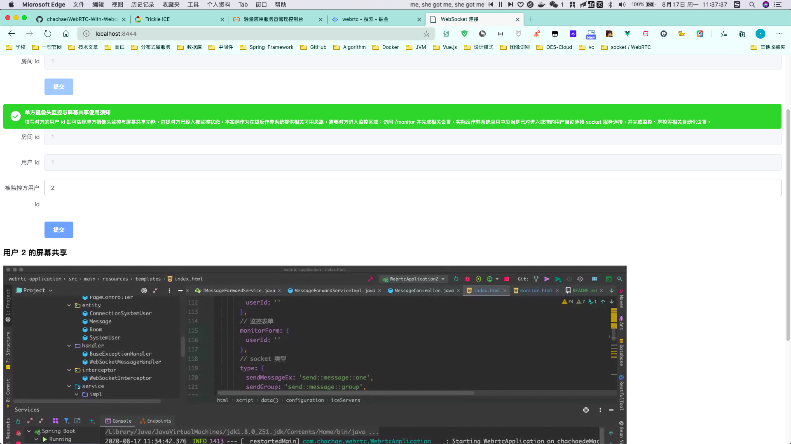
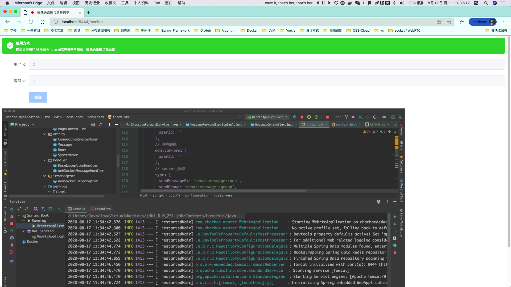

## WebRTC-One-Way-Monitor


本案例已完成基于 WebSocket 服务和 WebRTC 实现发送一对一文本消息、群组消息、单向视频监控与屏幕共享案例，使用 SpringBoot作为应用基本框架，前端使用 Vue.js 实现。可用于局域网和公网**（已配置turn服务器的情况下）**完成一系列基于 WebRTC 实现的流媒体传输功能，本案例以在线考试反作弊系统为基点，构建目的意旨实现摄像头和屏幕共享的多对一单向监控功能，有此类需求的朋友可以通过本案例获得相关思路和灵感，而像即时通讯服务、面对面视频聊天等实现 GitHub 上的高星开源项目繁多，大家可移步相关项目学习。

### 相关介绍

WebRTC是一个支持网页浏览器进行实时语音对话或视频对话的API。Google 在 2011年6月1日收购了GIPS，并将webRTC开源。随后webRTC 在Google、Mozilla、Opera支持下被纳入W3C推荐标准。相关的学习文章非常多，建议先仔细阅读文章内容，领略一下 WebRTC 的精髓，往后进行开发才不会因为各种各样的概念而搞混了，因为本人在开发过程中遇到的坑也是挺多的，所以这里简单推荐几篇别人写的文章，我也是从中收获蛮多有用信息的，到此看不懂没关系，先预备着。

[WebRTC学习总结](https://juejin.im/post/6844903624561147918)

[CentOS搭建coturn服务器](https://blog.csdn.net/hello123yy/article/details/84976086)

[WebRTC中的信令和内网穿透技术 STUN / TURN](https://blog.csdn.net/shaosunrise/article/details/83627828?utm_medium=distribute.wap_relevant.none-task-blog-BlogCommendFromMachineLearnPai2-3.nonecase&depth_1-utm_source=distribute.wap_relevant.none-task-blog-BlogCommendFromMachineLearnPai2-3.nonecase)

[解决WebRTC视频通话，NAT穿透时，局域网有效而4G网无效的问题](https://blog.csdn.net/u013342752/article/details/103857499)

### 相关解决方案

集群环境下的消息传递解决方案：首先本段文字只是本人的一个思路，解决方案并不唯一。本案例 socket 消息通过 Redis 队列实现消息广播，由于 WebSocketSession 并不能通过序列化来实现某些（如：Redis 缓存）统一半持久化行为，所以大环境下通过静态域保存以完成会话存储就需要考虑集群环境下会话不在同一个服务节点上的问题，所以通过广播的方式使得在分布式或者集群环境下可以保证消息传输的可靠性，如果有需求的话可以替换为其它消息中间件来实现这一消息广播行为。

单向监控解决方案：如上所述本案例基于开发背景是为了实现单向监控，不同于IM服务。通阅读上述文章我们不难知晓 WebRTC 要求 createOffer 方一定要有Media stream，即视频音频流，可以使摄像头也可以是屏幕共享，而正常的用户操作应该是主动请求到对方的视频信息，因此我想到的是用被监控者的客户端来创建 CreateOffer。整体思路是监控者 A 去发一个命令让被监控者 B 创建 createOffer。而 B 正好是被监控方，保证的 Media stream 的存在的。

### 配置和启动

1. **[必选]** 在宿主机上安装 Redis 数据库，已安装可略过

2. 克隆本项目

3. **[可选]** 根据实际需求编辑类路径内 application.yml 相关配置

4. **[可选]** 根据实际需求编辑 monitor.html 内 <code>openLocalMedia</code>方法，更改监控目标。

   ```javascript
   // 摄像头（二选一）
   // navigator.mediaDevices.getUserMedia(this.mediaConstraints)
   // 屏幕共享（二选一）
   navigator.mediaDevices.getDisplayMedia(this.screenConstraints)
   ```

5. 启动 Application，监控方访问 localhost:8444，被监控方访问： localhost:8444/monitor

### 截图

<table>
<tr>
    <td align="center" style="background: #fff"><b>监控方</b></td>
  </tr>
  <tr>
    <td align="center" style="background: #fff"></td>
  </tr>
  <tr>
    <td align="center" style="background: #fff"><b>被监控方</b></td>
  </tr>
  <tr>
    <td align="center" style="background: #fff"></td>
  </tr>
</table>

### License

```reStructuredText
Copyright [2020] [chachae]

Licensed under the Apache License, Version 2.0 (the "License");
you may not use this file except in compliance with the License.
You may obtain a copy of the License at

http://www.apache.org/licenses/LICENSE-2.0

Unless required by applicable law or agreed to in writing, software
distributed under the License is distributed on an "AS IS" BASIS,
WITHOUT WARRANTIES OR CONDITIONS OF ANY KIND, either express or implied.
See the License for the specific language governing permissions and
limitations under the License.
```
